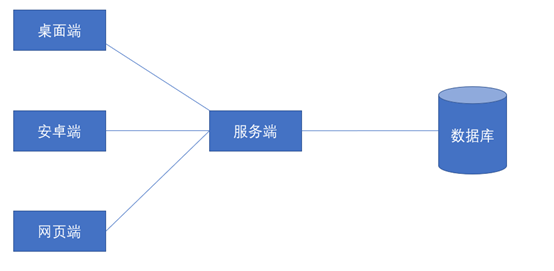

#  总体设计文档
  
  
  
##  项目总体
  
  


``` -->
  
##  模块介绍
  
  
###  客户端
  
  
  
|客户端|开发语言|开发框架|
|---|---|---|
|桌面端|C# 8.0(.NET Framework 4.8)|Windows Presentation Foundation|
|网页端|HTML/CSS
  
####  功能
  
  
|网页端|
|:---:|:---:|:---:|:---:|
|信息资料查看、编辑 |✔|✔|✔|
|信息资料统计       |✔|✔|✔|
|信息本地备份       |✔|✔|✖|
  
####  使用的接口(通过HTTP)
  
  
||登录系统|信息管理|记录修改信息|信息输出(本地)|
|---|:---:|:---:|:---:|:---:|
用户登录            |✔|✖|✖|✖|
输入工程师资料      |✖|✔|✔|✖|
删除指定工程师资料  |✖|✔|✔|✖|
查询指定工程师资料  |✖|✔|✖|✖|
修改指定工程师资料  |✖|✔|✔|✖|
保存工程师资料      |✖|✔|✔|✖|
排序工程师资料      |✖|✔|✖|✖|
输出工程师资料      |✖|✖|✖|✔|
计算工程师每月薪水  |✖|✖|✖|✔|
清空工程师资料      |✖|✔|✔|✖|
打印工程师资料      |✖|✖|✖|✔|
重新获得工程师资料  |✖|✔|✔|✖|
管理员登录          |✔|✖|✖|✖|
退出系统            |✔|✖|✖|✖|
  
  
###  服务端
  
  
开发语言： C# 8.0
  
开发框架： ASP.NET MVC + Entity Framework
  

  
使用接口：
+ 数据库
  
###  数据库
  
  
数据库：SQLSERVER
  
持久化框架：Entity Framework
  
数据库设计：使用EF 从数据库 实体类反向生成